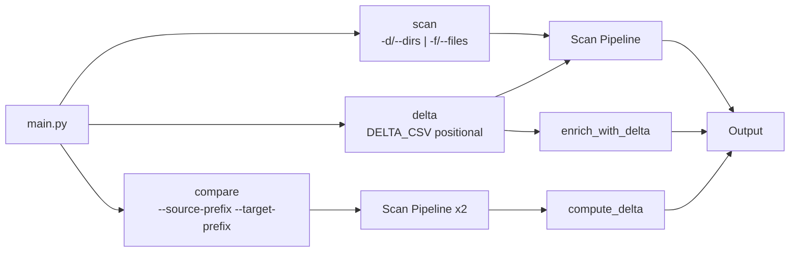
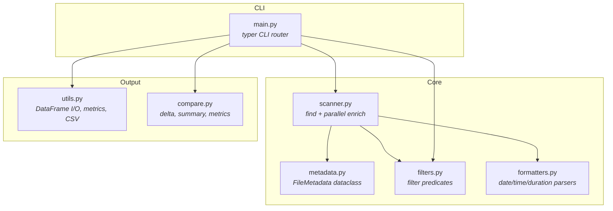
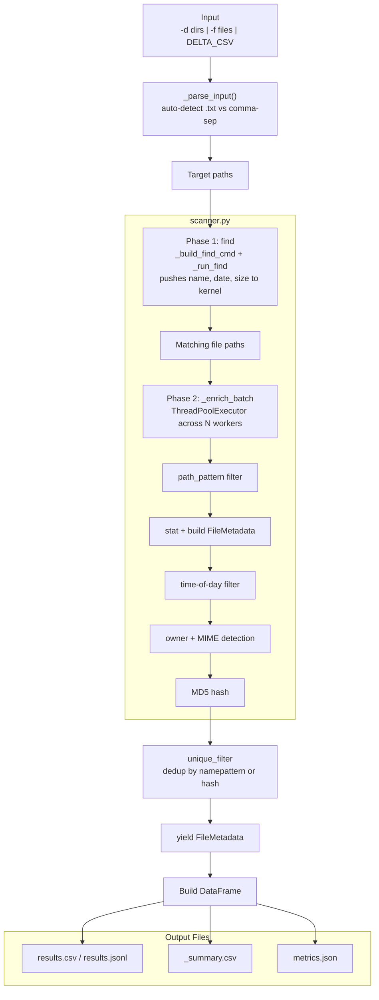
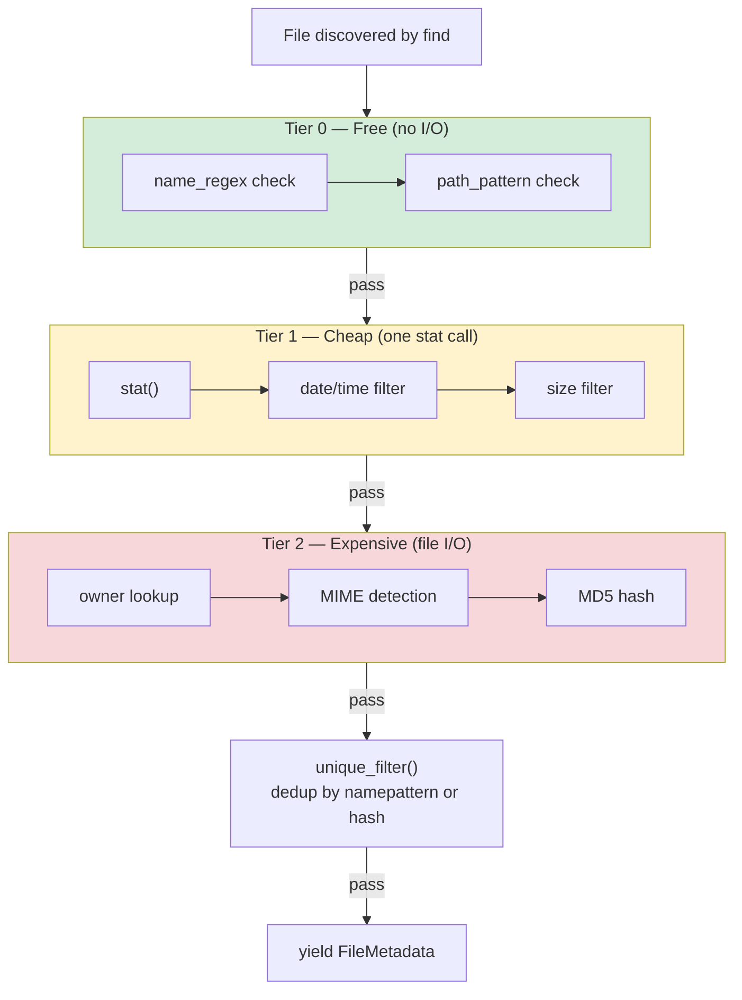
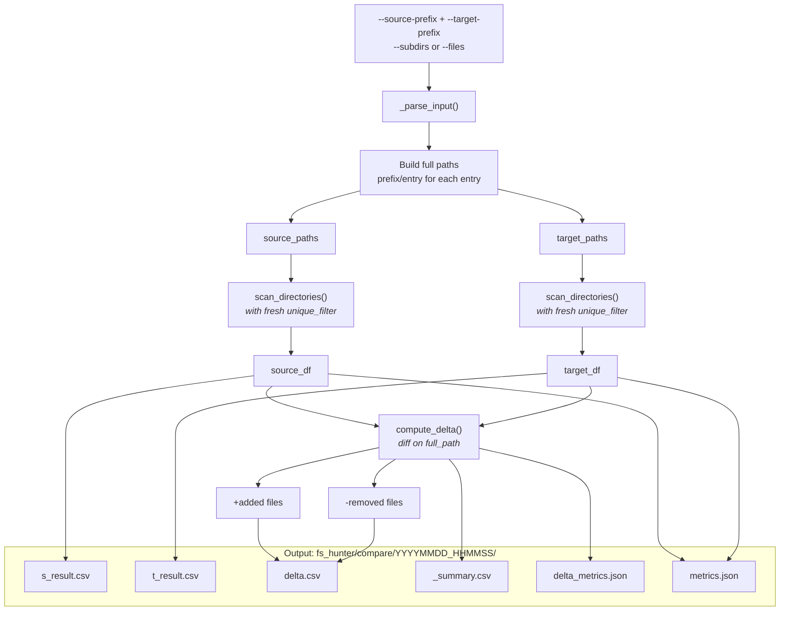
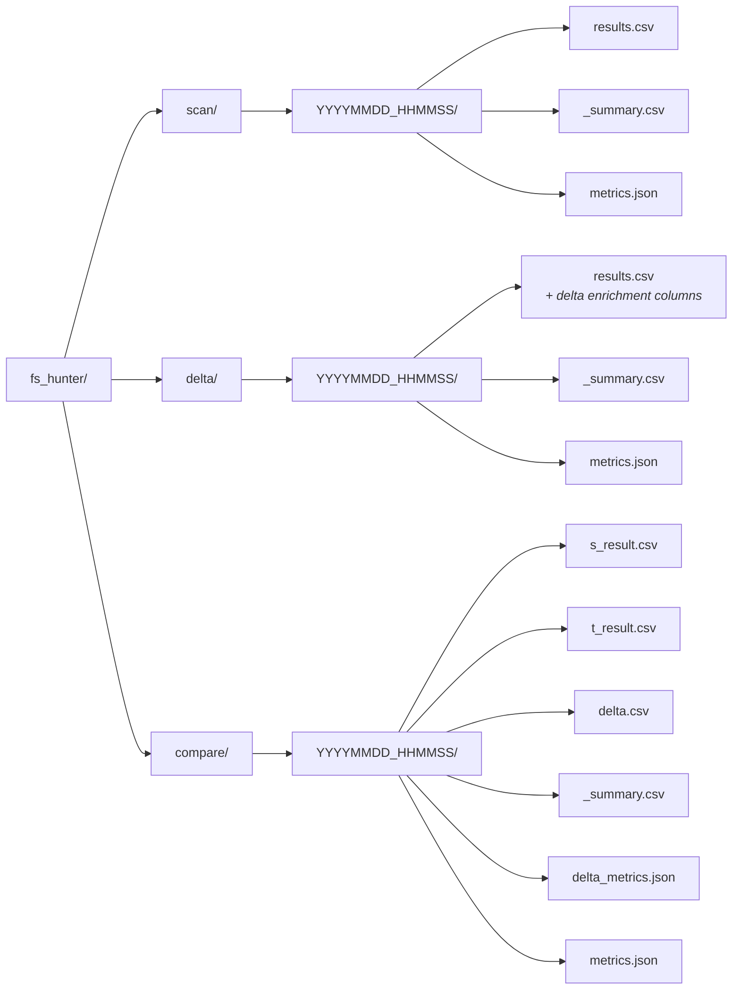

# fs-hunter

A Python CLI tool for scanning directories, extracting extended file metadata, applying powerful filters, and exporting structured results. Built for data engineering workflows where you need to inventory, deduplicate, and catalog files across large directory trees.

## Features

- **Extended metadata extraction** — name, extension, size, created/modified dates, permissions, owner, MIME type, MD5 checksum
- **Smart filtering** — lookback duration, date ranges, time-of-day windows, file size, regex on filenames, glob on paths, deduplication
- **3 subcommands** — `scan` (directories or files), `delta` (CSV manifest), `compare` (diff two trees)
- **Auto-detecting input** — pass comma-separated values or a `.txt` file; fs-hunter detects which automatically
- **Delta CSV enrichment** — map scanned files back to dataset/table metadata from a CSV manifest
- **Multi-threaded scanning** — parallel directory walks with configurable worker count
- **Rich progress bars** — real-time scan progress per directory in verbose mode
- **Flexible output** — CSV (default) or JSONL, with automatic summary stats

## Setup

### Prerequisites

- Python 3.10+ (check with `python --version` or `python3 --version`)
- `pip` (comes with Python)
- `git`

### Step 1: Clone the repository

```bash
git clone https://github.com/DataTrekLabs/fs-hunter.git
cd fs-hunter
```

### Step 2: Create a Python virtual environment

```bash
# Linux/macOS
python3 -m venv venv
source venv/bin/activate

# Windows
python -m venv venv
venv\Scripts\activate
```

You should see `(venv)` in your terminal prompt after activation.

### Step 3: Install dependencies

```bash
pip install -r requirements.txt
```

This installs: `typer`, `rich`, `pandas`, `python-magic`, `python-dotenv`.

### Step 4: Configure environment (optional)

```bash
cp .env.example .env
```

Edit `.env` to configure:

```
FS_HUNTER_OUTPUT_DIR=/sf/home/youruser/output
ENABLE_HASH=true
```

| Variable | Default | Description |
|---|---|---|
| `FS_HUNTER_OUTPUT_DIR` | `~` | Output folder (avoids passing `-o` every time) |
| `ENABLE_HASH` | `true` | Compute MD5 hash for each file. Set to `false` to disable globally |

CLI flags override `.env` values.

### Step 5: Verify installation

```bash
python main.py --help
python main.py scan --help
python main.py delta --help
python main.py compare --help
```

### Updating

```bash
cd fs-hunter
git pull
source venv/bin/activate   # Linux/macOS
pip install -r requirements.txt
```

### Dependencies

| Package | Purpose |
|---|---|
| `typer` | CLI framework with subcommands |
| `rich` | Terminal formatting and progress bars |
| `pandas` | DataFrame operations and CSV/JSONL output |
| `python-magic` | MIME type detection via file headers |
| `python-dotenv` | Load `.env` configuration |

## Quick Start

```bash
# Scan /data for parquet files modified in the last hour (all defaults)
python main.py scan -d /data

# Scan with 7-day lookback
python main.py scan -d /data --lookback 7D

# Scan with verbose progress and CSV output
python main.py scan -d /data --lookback 1D -v --output-format csv

# Scan from delta CSV manifest
python main.py delta manifest.csv --lookback 7D -v

# Compare two directory trees
python main.py compare --source-prefix /data/v1 --target-prefix /data/v2 --subdirs 20260206,20260207 -v
```

## Commands

fs-hunter has three subcommands:

| Command | Description |
|---|---|
| `scan` | Scan directories or specific files and extract file metadata |
| `delta` | Scan directories from a delta CSV manifest with enrichment |
| `compare` | Scan two directory trees with the same filters, then diff results |

```bash
python main.py scan [OPTIONS]
python main.py delta DELTA_CSV [OPTIONS]
python main.py compare [OPTIONS]
```

## Scan Command

Provide either `-d`/`--dirs` (directories) or `-f`/`--files` (specific files). They are mutually exclusive.

Both flags auto-detect their input: if the value ends with `.txt` and the file exists, lines are read from it; otherwise the value is split on commas.

```bash
# Single directory
python main.py scan -d /data/raw

# Multiple directories (comma-separated)
python main.py scan -d /data/raw,/data/derived

# Directories from a text file (auto-detect: ends with .txt)
python main.py scan -d paths.txt

# Single or multiple specific files
python main.py scan -f /data/file1.parq,/data/file2.parq

# Files from a text file (auto-detect)
python main.py scan -f files.txt
```

### Scan CLI Reference

| Flag | Short | Default | Description |
|---|---|---|---|
| `--dirs` | `-d` | | Directories (comma-separated or .txt file) |
| `--files` | `-f` | | Specific files (comma-separated or .txt file) |
| `--lookback` | | `1H` | Relative duration: `7D`, `2H`, `1D12H30M` |
| `--scan-start` | | | Absolute date range start (overrides lookback) |
| `--scan-end` | | | Absolute date range end (overrides lookback) |
| `--day-start` | | `00:00:00` | Time-of-day filter start |
| `--day-end` | | `23:59:59` | Time-of-day filter end |
| `--file-pattern` | | `glob *.parq*` | Pattern on filename: `glob\|regex PATTERN` |
| `--path-pattern` | | | Pattern on relative path: `glob\|regex PATTERN` |
| `--min-size` | | | Minimum file size in bytes |
| `--max-size` | | | Maximum file size in bytes |
| `--unique` | | `namepattern` | Dedup mode: `hash` or `namepattern` |
| `--off-hash` | | `false` | Disable MD5 hash computation |
| `--output-format` | | `csv` | Output format: `csv` or `jsonl` |
| | `-o` | `~` | Output folder |
| `--workers` | `-w` | `4` | Parallel scan threads |
| `--verbose` | `-v` | `false` | Show Rich progress bars |
| `--no-metrics` | | `false` | Skip metrics.json generation |
| `--metrics-interval` | | `30` | Time bucket size in minutes |

## Delta Command

Scan directories listed in a delta CSV manifest and enrich output with dataset/table metadata.

The CSV must contain these columns: `Directory`, `Dataset Repo`, `SF Table`, `Filename`. The tool extracts unique directories for scanning and enriches output with the dataset/table metadata.

```bash
python main.py delta manifest.csv --lookback 7D -v
python main.py delta manifest.csv --output-format csv -o /reports
```

### Delta CLI Reference

| Flag | Short | Default | Description |
|---|---|---|---|
| `DELTA_CSV` | | **(required, positional)** | Path to CSV with Directory column |
| `--lookback` | | `1H` | Relative duration: `7D`, `2H`, `1D12H30M` |
| `--scan-start` | | | Absolute date range start (overrides lookback) |
| `--scan-end` | | | Absolute date range end (overrides lookback) |
| `--day-start` | | `00:00:00` | Time-of-day filter start |
| `--day-end` | | `23:59:59` | Time-of-day filter end |
| `--file-pattern` | | `glob *.parq*` | Pattern on filename: `glob\|regex PATTERN` |
| `--path-pattern` | | | Pattern on relative path: `glob\|regex PATTERN` |
| `--min-size` | | | Minimum file size in bytes |
| `--max-size` | | | Maximum file size in bytes |
| `--unique` | | `namepattern` | Dedup mode: `hash` or `namepattern` |
| `--off-hash` | | `false` | Disable MD5 hash computation |
| `--output-format` | | `csv` | Output format: `csv` or `jsonl` |
| | `-o` | `~` | Output folder |
| `--workers` | `-w` | `4` | Parallel scan threads |
| `--verbose` | `-v` | `false` | Show Rich progress bars |
| `--no-metrics` | | `false` | Skip metrics.json generation |
| `--metrics-interval` | | `30` | Time bucket size in minutes |

## Date and Time Filters

### Lookback duration (`--lookback`)

The **default** date filter. Scans files modified within the given duration from now.

```bash
# Last hour (default)
python main.py scan -d /data

# Last 7 days
python main.py scan -d /data --lookback 7D

# Last 2 hours
python main.py scan -d /data --lookback 2H

# Last 1 day, 12 hours, 30 minutes
python main.py scan -d /data --lookback 1D12H30M
```

**Supported units:** `D` (days), `H` (hours), `M` (minutes). Can be combined: `1D12H30M`.

**Default:** `1H` (last 1 hour).

### Date range (`--scan-start`, `--scan-end`)

Absolute date range filter. When either `--scan-start` or `--scan-end` is provided, it **overrides** `--lookback`.

Supports partial dates with smart auto-complete:

| Input | Interpreted as |
|---|---|
| `2024` | `2024-01-01 00:00:00` |
| `2024-06` | `2024-06-01 00:00:00` |
| `2024-06-15` | `2024-06-15 00:00:00` |
| `2024-06-15 14` | `2024-06-15 14:00:00` |
| `2024-06-15 14:30` | `2024-06-15 14:30:00` |
| `2024-06-15 14:30:45` | `2024-06-15 14:30:45` |

When using date range mode: `--scan-start` defaults to yesterday 00:00:00, `--scan-end` defaults to now.

```bash
# Files modified in 2024
python main.py scan -d /data --scan-start 2024 --scan-end 2025

# Files modified since a specific date
python main.py scan -d /data --scan-start "2026-02-01"

# Files modified in a specific window
python main.py scan -d /data --scan-start "2026-02-01" --scan-end "2026-02-07 23:59:59"
```

### Time-of-day window (`--day-start`, `--day-end`)

Filter by time-of-day regardless of date. Works alongside both lookback and date range. Supports midnight wrapping.

```bash
# Files modified during business hours only
python main.py scan -d /data --day-start 09:00 --day-end 17:00

# Files modified overnight (wraps midnight)
python main.py scan -d /data --day-start 22:00 --day-end 06:00
```

Supports partial time input: `14` becomes `14:00:00`, `14:30` becomes `14:30:00`.

**Defaults:** `--day-start` = `00:00:00`, `--day-end` = `23:59:59` (all times).

## File Filters

### Filename regex (`--file-pattern`)

Regex pattern matched against the filename.

```bash
# Default: parquet files
python main.py scan -d /data --file-pattern ".*\.parq(uet)?$"

# CSV files
python main.py scan -d /data --file-pattern ".*\.csv$"

# Files starting with "report_"
python main.py scan -d /data --file-pattern "^report_"
```

**Default:** `.*\.parq(uet)?$` (parquet files).

### Path glob (`--path-pattern`)

Glob pattern matched against the file's relative path from the scan root.

```bash
# Only files under "derived/" subdirectories
python main.py scan -d /data --path-pattern "derived/*"

# Parquet files in any "daily" folder
python main.py scan -d /data --path-pattern "*/daily/*.parq"
```

### File size (`--min-size`, `--max-size`)

Filter by file size in bytes.

```bash
# Files larger than 1MB
python main.py scan -d /data --min-size 1048576

# Files between 1KB and 100MB
python main.py scan -d /data --min-size 1024 --max-size 104857600
```

## Deduplication (`--unique`)

Controls how duplicate files are identified. Only the first occurrence is kept.

| Mode | Behavior |
|---|---|
| `namepattern` | Groups files by structural name pattern. `report_20250601.csv` and `report_20240115.csv` both match `report_\d{4}\d{2}\d{2}\.csv` — only one is kept. |
| `hash` | Groups by MD5 checksum — identical content = duplicate. |

**Default:** `namepattern`.

```bash
# Deduplicate by content hash
python main.py scan -d /data --unique hash

# Deduplicate by name structure (default)
python main.py scan -d /data --unique namepattern
```

## Output

### Output format (`--output-format`)

```bash
# CSV output (default)
python main.py scan -d /data --output-format csv

# JSONL output
python main.py scan -d /data --output-format jsonl
```

### Output folder (`-o`)

The tool creates a timestamped directory `fs_hunter_YYYYMMDD_HHMMSS/` inside the specified folder.

```bash
# Output to home directory (default)
python main.py scan -d /data

# Output to specific folder
python main.py scan -d /data -o /reports
```

**Output structure:**

```
/reports/fs_hunter/scan/20260207_143022/
  results.csv        # or results.jsonl
  _summary.csv       # scan statistics
  metrics.json       # scan performance and breakdown stats
```

The `_summary.csv` contains: scan time, start/end range, targets scanned, total files, total size, unique extensions.

### Metrics (`metrics.json`)

Generated by default alongside results. Contains scan performance stats and file breakdowns:

| Section | Contents |
|---|---|
| `scan_performance` | `total_matched`, `scan_duration_seconds` |
| `size_stats` | `total_bytes`, `avg_bytes`, `min_bytes`, `max_bytes` |
| `by_extension` | Count and total bytes per file extension |
| `by_directory` | Count and total bytes per parent directory |
| `time_buckets` | 24h split into N-minute intervals with count, total bytes, file list, peak bucket, and empty bucket count |

```bash
# Default: metrics.json with 30-minute buckets
python main.py scan -d /data --lookback 1D

# Custom 60-minute buckets
python main.py scan -d /data --lookback 1D --metrics-interval 60

# Skip metrics generation
python main.py scan -d /data --no-metrics
```

## Performance

### Workers (`--workers` / `-w`)

Number of parallel threads for scanning multiple directories.

```bash
# Use 8 threads
python main.py scan -d /data/a,/data/b,/data/c -w 8
```

**Default:** 4.

### Verbose mode (`--verbose` / `-v`)

Shows real-time Rich progress bars per directory with scanned/matched file counts.

```bash
python main.py scan -d /data -v
```

## Metadata Fields

Each scanned file produces the following fields:

| Field | Description |
|---|---|
| `name` | Filename (e.g., `report_20250601.parq`) |
| `extension` | Full extension including compound (e.g., `.tar.gz`) |
| `full_path` | Absolute resolved path |
| `size_bytes` | File size in bytes |
| `created` | Creation timestamp (`YYYY-MM-DD HH:MM:SS`) |
| `modified` | Last modified timestamp (`YYYY-MM-DD HH:MM:SS`) |
| `permissions` | Unix-style permission string (e.g., `-rw-r--r--`) |
| `owner` | File owner (or `N/A` if unavailable) |
| `mime_type` | Detected MIME type (or `unknown`) |
| `md5` | MD5 checksum (computed by default; disable with `--off-hash` or `ENABLE_HASH=false`) |

When using `delta` command, three additional columns are enriched:

| Field | Description |
|---|---|
| `dataset_repo` | Dataset repository from the CSV manifest |
| `sf_table` | Snowflake table name from the CSV manifest |
| `filename_pattern` | Filename pattern from the CSV manifest |

## Filter Execution Order

Filters are applied in this order during scanning:

1. **Lookback / Date range** — skip files outside the modified date window
2. **Time-of-day** — skip files outside the time window
3. **Size range** — skip files outside the size bounds
4. **Path pattern** — glob match on relative path
5. **Name pattern** — regex match on filename
6. **MD5 hash** — computed for all matching files by default (disable with `--off-hash` or `ENABLE_HASH=false`)
7. **Unique filter** — deduplicate (applied last, after all other filters)

## Compare Command

The `compare` command scans two directory trees with the same filter flags, then diffs the results to show added and removed files.

Provide `--source-prefix` and `--target-prefix` as the base paths, then either `--subdirs` (directory names to scan under each prefix) or `--files` (file paths relative to each prefix).

Both `--subdirs` and `--files` auto-detect: if the value ends with `.txt` and the file exists, lines are read from it; otherwise the value is split on commas.

```bash
python main.py compare --source-prefix /data/v1 --target-prefix /data/v2 --subdirs 20260206,20260207
python main.py compare --source-prefix /data/v1 --target-prefix /data/v2 --subdirs subdirs.txt
python main.py compare --source-prefix /data/v1 --target-prefix /data/v2 --files file1.parq,file2.parq
```

### Compare CLI Reference

| Flag | Short | Default | Description |
|---|---|---|---|
| `--source-prefix` | | **(required)** | Source (baseline) base path |
| `--target-prefix` | | **(required)** | Target (current) base path |
| `--subdirs` | | | Subdirectory names (comma-separated or .txt file) |
| `--files` | | | File paths relative to prefix (comma-separated or .txt file) |
| `--lookback` | | `1H` | Relative duration: `7D`, `2H`, `1D12H30M` |
| `--scan-start` | | | Absolute date range start (overrides lookback) |
| `--scan-end` | | | Absolute date range end (overrides lookback) |
| `--day-start` | | `00:00:00` | Time-of-day filter start |
| `--day-end` | | `23:59:59` | Time-of-day filter end |
| `--file-pattern` | | `glob *.parq*` | Pattern on filename: `glob\|regex PATTERN` |
| `--path-pattern` | | | Pattern on relative path: `glob\|regex PATTERN` |
| `--min-size` | | | Minimum file size in bytes |
| `--max-size` | | | Maximum file size in bytes |
| `--unique` | | `namepattern` | Dedup mode: `hash` or `namepattern` |
| `--off-hash` | | `false` | Disable MD5 hash computation |
| | `-o` | `~` | Output folder |
| `--workers` | `-w` | `4` | Parallel scan threads |
| `--verbose` | `-v` | `false` | Show Rich progress bars |
| `--no-metrics` | | `false` | Skip metrics.json generation |
| `--metrics-interval` | | `30` | Time bucket size in minutes |

### Compare Output

```
fs_hunter/compare/{YYYYMMDD_HHMMSS}/
    _summary.csv         — source_dir, target_dir, file counts, added/removed/unchanged
    s_result.csv         — full source scan results
    t_result.csv         — full target scan results
    delta.csv            — added (+) and removed (-) files with change column
    delta_metrics.json   — breakdown by extension and change type, size totals
    metrics.json         — combined scan metrics (time buckets, size stats)
```

### Compare Examples

```bash
# Compare two directories for parquet file changes in the last 7 days
python main.py compare \
  --source-prefix /data/v1 \
  --target-prefix /data/v2 \
  --subdirs 20260201,20260202,20260203 \
  --lookback 7D -v

# Compare specific files between two trees
python main.py compare \
  --source-prefix /data/v1 \
  --target-prefix /data/v2 \
  --files report.parq,summary.parq \
  -w 8 -v

# Compare with subdirs from a text file
python main.py compare \
  --source-prefix /data/old \
  --target-prefix /data/new \
  --subdirs subdirs.txt \
  --lookback 1D \
  -o /reports
```

## Architecture

### CLI Structure



### Module Map



### Scan Pipeline

All three subcommands share the same core scan pipeline:



### Filter Cascade (Three Tiers)



### Compare Data Flow



### Output Directory Structure



## Examples

### Scan Examples

```bash
# Default: scan for parquet files modified in the last hour
python main.py scan -d /data

# Last 7 days, verbose progress
python main.py scan -d /data --lookback 7D -v

# Absolute date range for all of 2024
python main.py scan -d /data --scan-start 2024 --scan-end 2025

# Multiple dirs, CSV files, dedup by hash, 8 threads
python main.py scan -d /data/raw,/data/derived \
  --file-pattern regex ".*\.csv$" \
  --lookback 30D \
  --unique hash \
  -w 8 -v

# Dirs from a text file
python main.py scan -d paths.txt -v

# Specific files
python main.py scan -f /data/file1.parq,/data/file2.parq

# Large files only, business hours
python main.py scan -d /warehouse \
  --min-size 1048576 \
  --day-start 09:00 --day-end 17:00 \
  --lookback 7D -v

# Path glob filter for specific subdirectories
python main.py scan -d /data \
  --path-pattern glob "*/daily/*.parq" \
  --lookback 1D
```

### Delta Examples

```bash
# Scan from delta CSV manifest with enrichment
python main.py delta manifest.csv -v --output-format csv -o /reports

# Delta with 7-day lookback
python main.py delta manifest.csv --lookback 7D -v
```

### Compare Examples

```bash
# Compare two directories for changes in the last 7 days
python main.py compare \
  --source-prefix /data/v1 \
  --target-prefix /data/v2 \
  --subdirs 20260206,20260207 \
  --lookback 7D -v

# Compare with custom file pattern
python main.py compare \
  --source-prefix /data/v1 \
  --target-prefix /data/v2 \
  --subdirs 20260206 \
  --file-pattern glob "*.csv" \
  -w 8 -v -o /reports
```

## Viewing Results

Useful commands for inspecting output CSVs on the server:

```bash
# View summary formatted as table
column -s, -t /path/to/fs_hunter/scan/YYYYMMDD_HHMMSS/_summary.csv

# View specific columns from results (e.g. full_path, ctime, mtime)
awk -F, '{print $3","$5","$6}' /path/to/fs_hunter/scan/YYYYMMDD_HHMMSS/results.csv | column -s, -t

# View name, ctime, mtime columns
awk -F, '{print $1","$5","$6}' /path/to/fs_hunter/scan/YYYYMMDD_HHMMSS/results.csv | column -s, -t
```

**Results CSV columns:** `name, extension, full_path, size_bytes, ctime, mtime, permissions, owner, mime_type, md5`

### Inspecting JSON with jq

```bash
# View metrics.json pretty-printed
jq . /path/to/fs_hunter/scan/YYYYMMDD_HHMMSS/metrics.json

# Scan performance summary
jq '.scan_performance' metrics.json

# Size stats
jq '.size_stats' metrics.json

# File count per extension
jq '.by_extension' metrics.json

# List extensions with more than 10 files
jq '.by_extension | to_entries[] | select(.value.count > 10)' metrics.json

# Peak time bucket
jq '.time_buckets | {peak_bucket, peak_count}' metrics.json

# Non-empty time buckets only
jq '.time_buckets.buckets[] | select(.count > 0)' metrics.json

# File count per directory
jq '.by_directory | to_entries[] | sort_by(-.value.count)' metrics.json

# Delta metrics: added vs removed summary
jq '.by_change_type' delta_metrics.json

# Delta: added/removed count per extension
jq '.by_extension' delta_metrics.json

# Total size added and removed
jq '{added_bytes: .total_size_added_bytes, removed_bytes: .total_size_removed_bytes}' delta_metrics.json
```

## License

Internal use.
